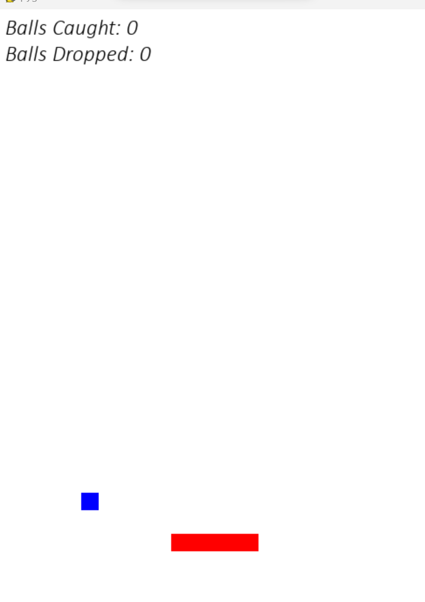

# Game Builder using CrewAI and Gemini Pro

We have developed a Game-Building Bot where we need to provide instructions on how to design the game and it will handle all of the coding. This is accomplished with the assistance of CrewAI and the Google Gemini-Pro model.

This provides the potential to create complex games with a variety of conditions. A Python file contains the output gaming code. Something needs minor adjustments to function properly.

**Sample Game Output**



## Installation

* Clone the repo
* Install the required packages
```shell
pip install -r requirements.txt
```
* Create a .env file to add GOOGLE_API_KEY
```shell
GOOGLE_API_KEY = 'YOUR_API_KEY'
```
* Run the main.py in the terminal
```shell
python run main.py
```

* Enter your game instructions in the terminal.

* The output file will be saved under the name sample.py.

**_NOTE:_**   A sample input prompt is given in the folder, and some changes may be needed in the *output Python file*.


## Authors

- [@sasidhar](https://github.com/sastrysasi4)

